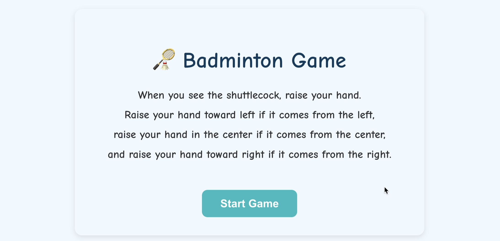
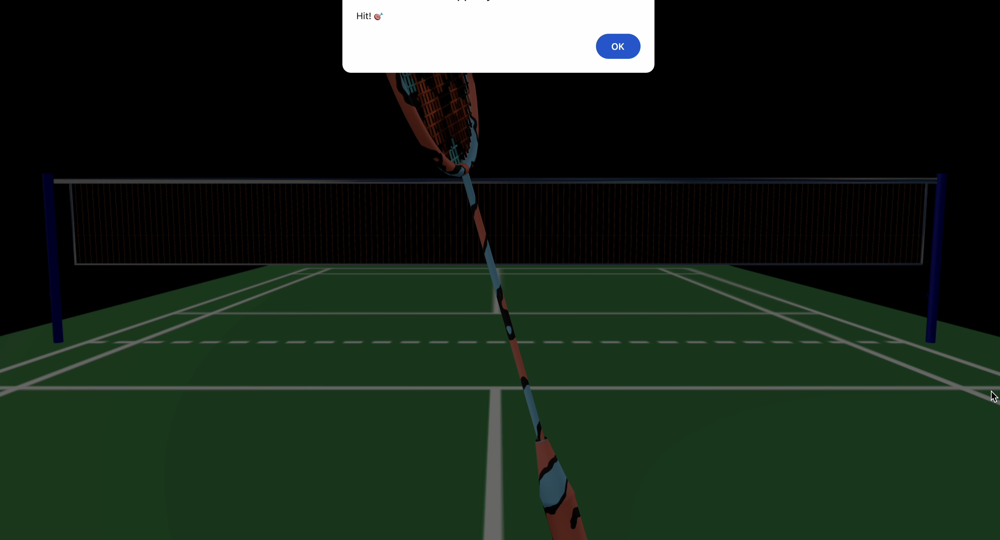
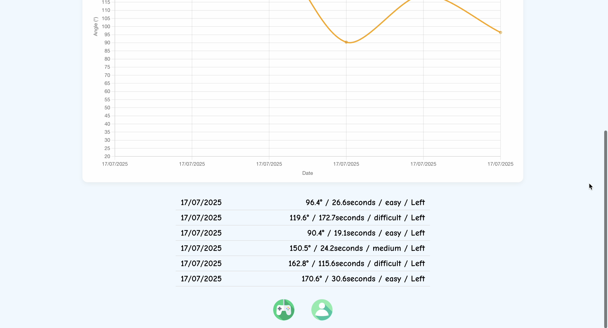
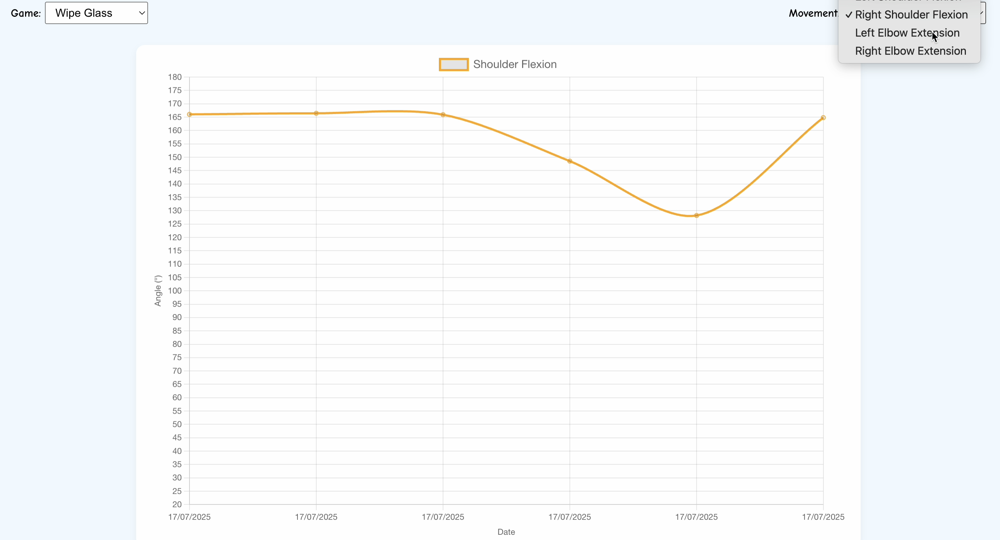

# FunMotion
A web-based rehabilitation game for upper limb training using pose estimation and AI feedback.

## Features
- Pose estimation via MediaPipe
- Real-time ROM angle visualization
- ML model feedback for movement correctness

## Technologies
React.js • Firebase • MediaPipe • FastAPI • SVM

